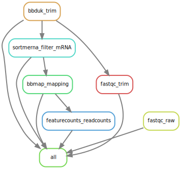

<a href="https://github.com/wegnerce/smk_rnaseq/releases/"></a>  <a href="#license"></a> <a href="https://python.org" title="Go to Python homepage"></a> <a href="https://doi.org/10.5281/zenodo.8075177"></a> <a href="https://snakemake.github.io">
# smk_rnaseq - A Snakemake-based workflow for RNAseq data processing

This workflow was used for RNAseq data processing in the following studies:
> * Gorniak et al., (2023)  **[Different lanthanide elements induce strong gene expression changes in a lanthanide-accumulating methylotroph.](https://www.biorxiv.org/content/10.1101/2023.03.06.530795v1)** _biorxiv_ 
> * Wegner et al., (2021) **[Extracellular and Intracellular Lanthanide Accumulation in the Methylotroph Beijerinckiaceae Bacterium RH AL1.](https://journals.asm.org/doi/full/10.1128/AEM.03144-20?rfr_dat=cr_pub++0pubmed&url_ver=Z39.88-2003&rfr_id=ori%3Arid%3Acrossref.org)** _Appl Environ Microbiol_ 87:e03144-20
> * Wegner et al., (2020) **[Lanthanide-Dependent Methylotrophs of the Family Beijerinckiaceae: Physiological and Genomic Insights.](https://journals.asm.org/doi/10.1128/AEM.01830-19?url_ver=Z39.88-2003&rfr_id=ori:rid:crossref.org&rfr_dat=cr_pub%20%200pubmed)** _Appl Environ Microbiol_ 86:e01830-19

## :exclamation: Needed/used software
The workflow is based on the following tools: 
- [`fastQC`](https://www.bioinformatics.babraham.ac.uk/projects/fastqc/)
- [`bbmap`](https://jgi.doe.gov/data-and-tools/software-tools/bbtools/)  part of the BBtools suite
- [`SortMeRNA`](https://bioinfo.lifl.fr/RNA/sortmerna/) 
- [`samtools`](http://www.htslib.org/)
- [`featureCounts`](http://subread.sourceforge.net/) part of the Subread package

The separate installation of the tools is not necessary, they are installed 'on the fly' (see _Usage_ below).

[`Snakemake`](https://snakemake.github.io/) should be installed as outlined in its [documentation](https://snakemake.readthedocs.io/en/stable/getting_started/installation.html) for instance using [`conda`](https://docs.conda.io/en/latest/miniconda.html)/[`mamba`](https://github.com/conda-forge/miniforge#mambaforge). It is recommended to create a dedicated `conda` environment for Snakemake.

## :blue_book: Description of the workflow
Paired-end sequencing data (`stored in data/`) is first subjected to quality-control and adapter-trimming using `bbduk`. Quality reports are written using `fastQC` before and after trimming. mRNA-derived read pairs are identified by querying QCed reads against SSU and LSU databases using `SortMeRNA`. Next, mRNA-derived sequenced are mapped onto a reference genome with `bbmap`. Readcounts per feature (=CDS) are determined through `featureCounts`. The below DAG graph outlines the different processes of the workflow, exemplarily for two file pairs La.1* and Nd.1*.



## :hammer: Usage
Start by cloning the repository and move into respective directory.
```
git clone https://github.com/wegnerce/smk_rnaseq.git
cd smk_rnaseq
```
`SortMeRNA` relies on sequence databases, the used SSU and LSU databases and the corresponding indices can be downloaded from [`zenodo`](https://zenodo.org/).
```
cd resources
wget https://zenodo.org/record/8073631/files/smk_rnaseq_sortmerna_DBs.zip
unzip smk_rnaseq_sortmerba_DBs.zip
cd ..
```
Paired sequence data (R{1,2}.fastq.gz) should be stored under `data/`. The repository contains two pairs of exemplary files (La.1_R1.fastq.gz + La.1_R2.fastq.gz & Nd.1_R1.fastq.gz + Nd.1_R2.fastq.gz).

`config/` contains, besides from the configuration of the workflow (`config/config.yaml`), a tab-separated table `samples.tsv`, which contains a list of all datasets, one per line. The workflow expects `*.fastq.gz`files and `R{1,2}` as prefixes for forward and reverse read files.

From the root directory of the workflow, processing the data can then be started.
```
# --use-conda makes sure that needed tools are installed based
# on the requirements specified in the respective *.yaml in /envs
snakemake  --use-conda
```
The directory structure of the workflow is shown below:
```bash
├── config
│   ├── config.yaml
│   └── samples.tsv
├── data
│   ├── La.1_R1.fastq.gz
│   ├── La.1_R2.fastq.gz
│   ├── Nd.1_R1.fastq.gz
│   └── Nd.1_R2.fastq.gz
├── environment.yaml
├── LICENSE
├── README.md
├── resources
│   ├── adapters.fa
│   ├── RHAL1_chromosome_plasmid.fa
│   └── RHAL1_chromosome_plasmid.saf
├── smk_rnaseq.svg
└── workflow
    ├── envs
    │   ├── bbmap.yaml
    │   ├── fastqc.yaml
    │   ├── featurecounts.yaml
    │   └── sortmerna.yaml
    ├── rules
    │   ├── featurecounts.smk
    │   ├── mapping.smk
    │   ├── qc.smk
    │   └── sortmerna.smk
    └── Snakefile
```
Output from the different steps of the workflow are stored in `/results` and `/logs`. 

The readcount table generated by `featureCounts` (`results/04_COUNTS/readcounts_featureCounts.txt`) can be used for downstream differential gene expression analysis.

:copyright: Carl-Eric Wegner

